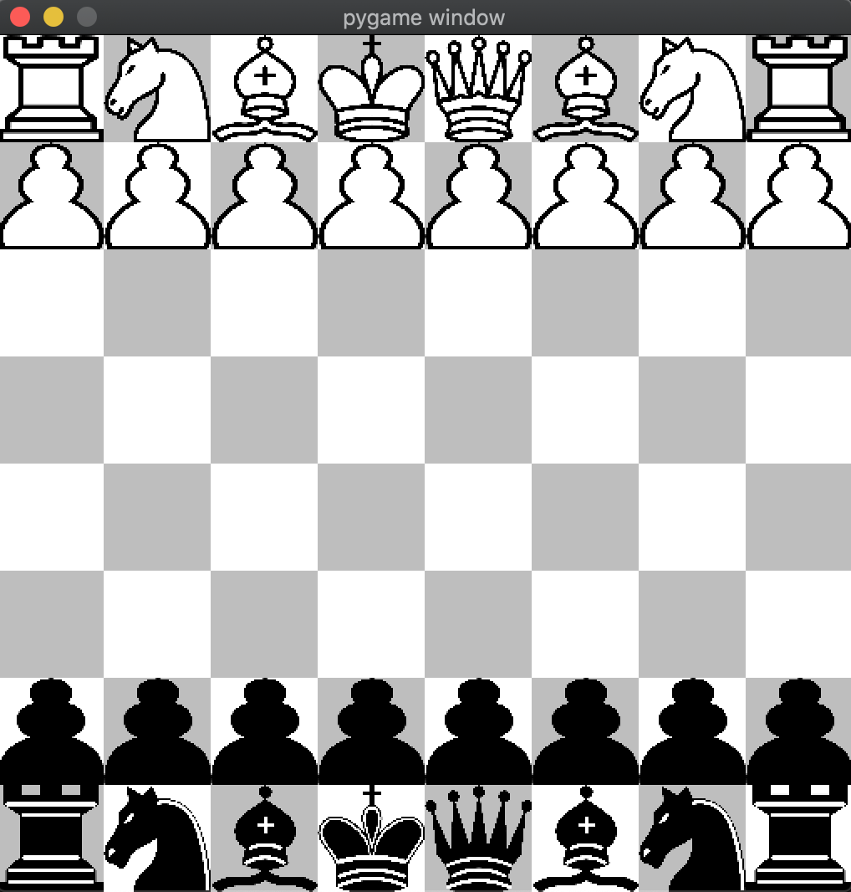
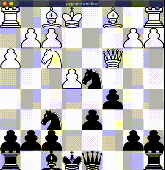

# Custom Chess Engine
A chess engine written from scratch, including single player mode and multiplayer mode, written using Python. A C++ implementation is slowly in the works.

[](https://kandi.openweaver.com/python/boosungkim/python-chess) [](https://kandi.openweaver.com/collections/gaming/chess)

<p align="center">

</p>

## Index
1. [About](#about)
2. [Demo](#demo)
3. [Usage](#usage)
    * [Installation](#installation)
    * [Commands](#commands)


<a name="about"></a>
## About
This project includes a full chess engine, gui engine, and an AI engine. The AI engine utilizes the minimax and alpha beta pruning algorithms.
As mentioned, a C++ implementation is slowly in the works.

<a name="demo"></a>
## Demo
| Human vs Human   | Human vs AI (AI is controlling black)  |
|:----------------------|:------------------|
| |  |


<a name="usage"></a>
## Usage
To install this project, make sure you have the correct version of Python and Pygame. Certain versions of pygame are no longer supported on macOS Catalina.

<a name="installation"></a>
### Installation
- Switch to Python3.
- Follow the code below to create virtual environment and install the necessary libraries.
(Currently tested on Python 3.7.9 with Pygame 2.0.0dev8 and Python 3.8.2 with Pygame 2.0.0 on macOS Catalina)
```
git clone https://github.com/pawanshukla0963/Game-Python-Chess.git
cd python-chess
python3 -m venv venv
source venv/bin/activate
pip install pygame
```

<a name="commands"></a>
### Commands
- To start the game, run `python3 -W ignore chess_gui.py`, then select the game mode you want to play in the command line.
- To undo a move, press `u`.
- To reset the board, press `r`.

